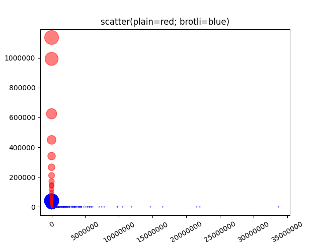
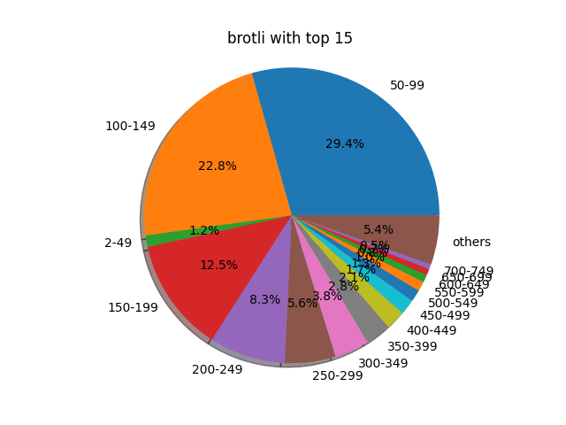

# 解压缩耗时计算

使用如下代码测试`brotli`解压缩，测试文件详见：

|| file | size|
|:--:|:--|:--:|
| brotli | [brotli_file](image/5f16b5c7df82571d75a9c1539a0912c06a3db890.br) | 6.7KB | 
| plain | [plain_file](image/5f16b5c7df82571d75a9c1539a0912c06a3db890.txt) | 39KB |


```kotlin
private class CopyStatistics(
    val consume: Long,
    val state: Int
)

private fun copyAssetsFile(
    assetManager: AssetManager?,
    assetFilePath: String,
    destFile: File?,
    block: ((inputStream: InputStream) -> InputStream)?
): CopyStatistics {
    if (assetManager == null || TextUtils.isEmpty(assetFilePath) ||
        destFile == null || block == null
    ) {
        return CopyStatistics(0, API.SCODE_ERROR)
    }

    val startTime = SystemClock.elapsedRealtime()

    var source: Source? = null
    var sink: Sink? = null
    try {
        source = Okio.buffer(Okio.source(block(assetManager.open(assetFilePath))))
        sink = Okio.buffer(Okio.sink(destFile))
        sink.writeAll(source!!)
        sink.flush()
        return CopyStatistics(SystemClock.elapsedRealtime() - startTime, API.SCODE_SUCCESS)
    } catch (e: Throwable) {
        // ignore error
        destFile.delete()
    } finally {
        try {
            source?.close()
        } catch (e: Throwable) {
            // ignore
            destFile.delete()
        }

        try {
            sink?.close()
        } catch (e: Throwable) {
            // ignore
            destFile.delete()
        }
    }

    return CopyStatistics(SystemClock.elapsedRealtime() - startTime, API.SCODE_ERROR)
}

val brotliCopyStatistics = copyAssetsFile(
    assetManager,
    "brotli_test/${TEST_FILE_DIGEST}.br",
    brotliFile
) { inputStream ->
    BrotliInputStream(inputStream, DEFAULT_BUFFER_SIZE)
}
// 验证文件完整性
val brotliCopyState = if (brotliCopyStatistics.state == API.SCODE_SUCCESS &&
    TEST_FILE_DIGEST == EncryptUtil.digest(brotliFile, "SHA-1")
) {
    API.SCODE_SUCCESS
} else {
    API.SCODE_ERROR
}

val plainCopyStatistics = copyAssetsFile(
    assetManager,
    "brotli_test/${TEST_FILE_DIGEST}.txt",
    plainFile
) { inputStream ->
    inputStream
}
```

# 2. 转换信息

我们分析信息时，主要使用了`sqlite3`和`python`工具，具体流程如下图：


## 1. txt文件转换为SQLite3数据库文件

下载 [sqlite3_util.py](src/sqlite3_util.py)文件，执行如下命令，即可将txt文件转换为sqlite3数据库文件，数据库名格式为为`时间+actionlog.db`。

```python
$ python3 src/sqlite3_util.py path/to/actionlog.txt
```

## 2. python脚本转换数据

我们以`tzcompression`为例，它主要统计了brotli压缩文件和未压缩文件的从asset中复制解压到cache中的时间和成功失败状态。`plain`前缀表示未压缩文件；`brotli`表示使用`brotli`方式的压缩文件。

|name|说明|
|:--:|:--|
| plain.d.time  | 未压缩文件复制耗时，单位为毫秒|
| plain.d.state | 1=复制成功；其他表示失败 |
| brotli.d.time | brotli压缩文件复制耗时，单位为毫秒|
| brotli.d.time | 1=复制成功；其他表示失败|


## 3. 数据抽取
打开上一步生成的数据库文件，抽取我们需要的数据：

```python
sql = f"select * from actionlog"
print(f"try execute {sql}")
cursor.execute(sql)
for row in cursor:
    wuxianData = json.loads(row['wuxian_data'])
    wuxianDataJson = wuxianData["json"]
    self.plainDecodeResult.add(wuxianDataJson["plain.d.state"], wuxianDataJson["plain.d.time"])
    self.brotliDecodeResult.add(wuxianDataJson["brotli.d.state"], wuxianDataJson["brotli.d.time"])
```

因为需要统计复制成功/失败次数/比例，复制耗时等数据，所以设计数据库表结构如下：

```sql
create table if not exists summary(
    success_count integer,      -- 复制成功次数
    fail_count integer,         -- 复制失败次数
    total_decode_time integer,  -- 总的复制时长
    decode_type text            -- 复制类型：plain=未压缩文件, brotli=brotli压缩文件
);

create table if not exists output(
    decode_time integer,    -- 复制时长
    decode_times integer,   -- 重复次数
    decode_type text        -- 复制类型：plain=未压缩文件, brotli=brotli压缩文件
)
```

将获取到的数据插入数据库，生成`时间+output.db`数据库，进行下一步分析：

```python
connection.executemany("""
    insert into summary(success_count, fail_count, total_decode_time, decode_type) 
    values(?, ?, ?, ?)
""", [
    (self.plainDecodeResult.successCount, self.plainDecodeResult.failCount, self.plainDecodeResult.totalTime, 'plain'),
    (self.brotliDecodeResult.successCount, self.brotliDecodeResult.failCount, self.brotliDecodeResult.totalTime, 'brotli')
])

outputs = []
for key, value in self.plainDecodeResult.timeDict.items():
    outputs.append((key, value, 'plain'))
for key, value in self.brotliDecodeResult.timeDict.items():
    outputs.append((key, value, 'brotli'))
connection.executemany("""
    insert into output(decode_time, decode_times, decode_type)
    values(?, ?, ?)
""", outputs)
```

# 3. 分析信息

## 1. 信息概要

```sql
SELECT 
    s.decode_type,
    s.success_count, 
    s.fail_count,
    (s.success_count * 1.0/ (s.success_count + s.fail_count)) as success_rate,
    (s.fail_count * 1.0 / (s.success_count + s.fail_count)) as fail_rate,	
    s.total_decode_time, 
    (s.total_decode_time * 1.0 / s.success_count) as avg_decode_time,
    mode.decode_time as mode_decode_time,
    mode.decode_times as mode_decode_times,
    (mode.decode_times * 1.0 / (s.success_count + s.fail_count)) as mode_decode_times_rate
FROM 
    summary as s,  
    ( 
        SELECT * 
        FROM output 
        GROUP BY decode_type 
        HAVING max(decode_times)
    ) as mode
WHERE s.decode_type = mode.decode_type
```


根据统计到的500w+的执行次数，可以得出以下结论：
1. brotli解压成功率比plain低一个数量级（0.999992 vs 0.999999）。
2. brotli解压缩平均耗时是plain的30多倍（415 vs 14）。
3. brotli解压缩耗时众数时plain的76倍（76 vs 1）；
4. brotli解压缩耗时众数为4w+占比不到1%，而plain的众数为113w+占比在19.8%；说明brotli解压缩耗时离散的范围很大，稳定性较差。

> 注意：解压缩耗时与线程调度/io均密切相关；但是由于我们统计的是在同一函数中，所以暂时忽略了其影响。

## 2. 信息图表

从下图可以看出，brotli耗时离散范围比plain大很多：



对比brotli和plain的饼图，可以看出:

1. [0-49]毫秒内，brotli占比**1.2%**；plain占比则为**96.1%**。
2. 当大于749毫秒时，brotli占比为**5.4%**；plain占比则为**0.12%**

| brotli | plain|
|:--:|:--:|
|  |  |
| [0-49] 1.2% | [0-49] 96.1% |
| > 749 309008=5.4% | > 749 6919=0.12%|

